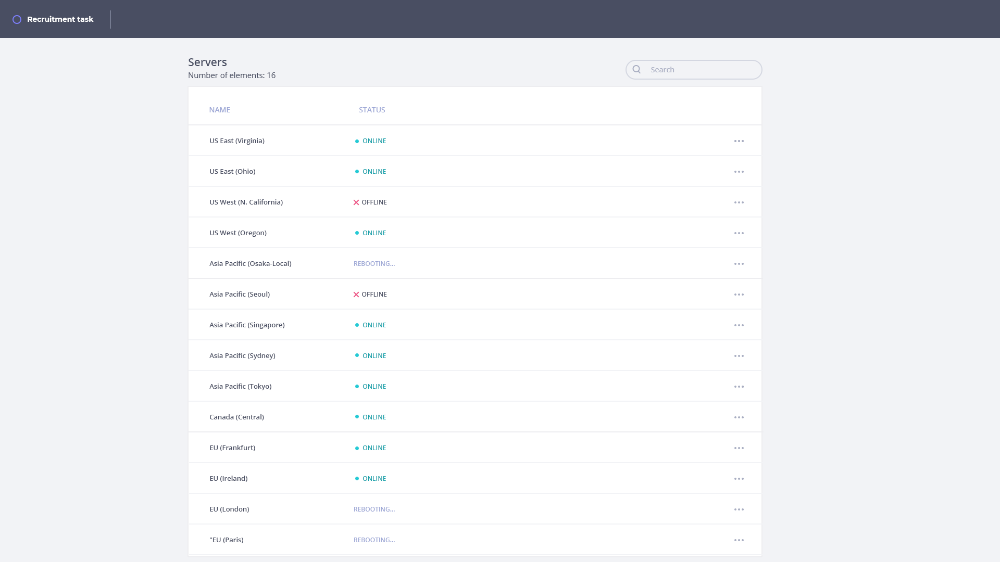

# Task

In Acaisoft we love working with cloud technologies. In this task you will have to create simple UI components that will allow a user to remotely manage many servers located all around the world.

## UI

Marcin, a hardworking DevOps, would like to see the statuses of all the servers Acaisoft currently maintains. He would like to manually turn them on or off and sometimes reboot if neccessary.

Your task is to provide such a functionality. Fortunately, our fantastic
designer Marta made a prototype for us. Here is how it looks:



Marta also made the [Invision](https://www.invisionapp.com/) project for us, so we can freely check out the styles.
The credentials are:
```
Email: acaisoft@tryzoe.com
Password: acaisoft248
```

### Tasks
 1. List all the servers.
 2. Provide 1:1 UI from the invision project (Pay attention to this)
 2. Add a clickable dropdown on the right with 2 options :
    1. Turn on (or Turn off) - depending on the status (You can't display Turn on with Turn Off dropdown option at the same time)
    2. Reboot (When server is rebooting please pay attention to how the dropdown looks like)
 3. When the server is in a `REBOOTING` status you should be pinging single server API endpoint `/servers/:serverId `  (e.g. every 1s) until the status changes.
 4. Allow the user to locally search for a server ( Pay attention to how your application behaves when you put something in search input)
 5. Add unit tests at least for rebooting functionality and if you want and you have time please add more tests.

### Tips
 - We really like small components.
 - Pay attention to code quality, conventions, formatting, etc.
 - You can use any libraries, but when you’re using something like ngrx or any other more advanced library please give us a quick note why do you use it.
 - Don't leave unneccesary code!!!
 
### General remarks

Your further recruitment path depends on how you’ll solve this task.

### Requirements

UI was created using Node.js v10.6.0. Other versions may or may not work correctly.

### Installation

In `./src` run:

```shell
npm ci
```

### Run

In `./src` run:

```shell
npm start
```

## API

To remotely administer the servers we have a REST API located in `./src` directory.
The API provides an interface listed in the table below:

| Method | Endpoint | Response | Description |
|---|---|---|---|
| GET | /servers | Array\<[Server](#types)\> | Returns a list of all servers. |
| GET | /servers/:serverId | [Server](#types) | Returns a server. |
| PUT | /servers/:serverId/on | [Server](#types) | Turns on a server |
| PUT | /servers/:serverId/off | [Server](#types) | Turns off a server |
| PUT | /servers/:serverId/reboot | [Server](#types) | Reboots a server |

#### Types
```typescript
interface Server {
    id: number;
    name: string;
    status: 'ONLINE' | 'OFFLINE' | 'REBOOTING';
}
```

### Requirements

Our API was created using Node.js v10.6.0. Other versions may or may not work correctly.

### Installation

In `./src` run:

```shell
npm ci
```

### Run

In `./src` run:

```shell
npm start
```
